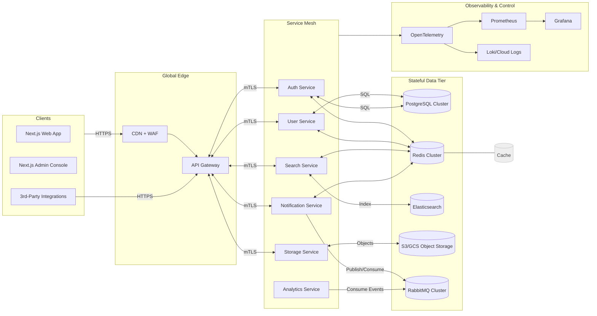

SYSTEM OVERVIEW

This repository defines a Google-scale, cloud-native, multi-region platform engineered for extreme reliability, elasticity, and velocity of change. The system embraces a modular monorepo with independently deployable services, strong contracts, and platform-level primitives for security, observability, and automation. At a high level:

- Clients: Web (Next.js), Admin Console (Next.js), Public APIs (REST/GraphQL/gRPC), and Internal tooling.
- Edge: CDN + WAF + API Gateway for global routing, TLS termination, authn/z, quotas, and request shaping.
- Services: Independently-scalable NestJS microservices: Auth, User, Invoice, Search, Notification, Analytics, Storage, plus API Gateway as the ingress/control plane for public APIs.
- Data: PostgreSQL (OLTP; sharded/partitioned), Redis (caching + rate limits + queues where needed), Elasticsearch (search/indexing), S3/GCS (object storage), RabbitMQ (asynchronous messaging and fanout), Time-series/OLAP (BigQuery/Snowflake or ClickHouse optional for analytics-at-scale).
- Platform: Kubernetes (EKS/GKE) for orchestration, HashiCorp Terraform for IaC, GitHub Actions for CI/CD, service mesh (Istio/Linkerd) for mTLS and traffic policy, OPA/Gatekeeper for policy, Prometheus/Grafana for metrics, OpenTelemetry for tracing, Loki/CloudWatch/Cloud Logging for logs.
- Reliability: Multi-AZ active-active, optional multi-region with RPO ~0 and RTO minutes via logical replication, stateless services with graceful degradation, bulkheading, circuit breakers, and backpressure.
- Security: Zero-trust, short-lived credentials (OIDC workload identity), secrets managers, envelope encryption (KMS), fine-grained RBAC/ABAC, and strict least privilege.

ARCHITECTURE DIAGRAM (Mermaid)

MONOREPO FILE STRUCTURE

This monorepo is organized to minimize coupling, maximize reuse, and enable high-velocity CI/CD. It follows a clear separation of concerns between apps (UIs), services (APIs/backends), shared packages, and infrastructure. The folders listed below exist or should be created as part of this design.

- apps/
  - web/                      Next.js end-user web app
  - admin-console/            Next.js admin console (internal)
- services/                   NestJS microservices
  - api-gateway/
  - auth-service/
  - user-service/
  - invoice-service/
  - search-service/
  - notification-service/
  - analytics-service/
  - storage-service/
- packages/                   Shared libraries (internal NPM packages)
  - common/                   DTOs, types, error codes, utilities
  - config/                   Configuration loader, schema validation
  - logger/                   OpenTelemetry + pino logger wrappers
  - sdk-js/                   Public JS SDK/Client
  - clients/                  API clients, message producers/consumers
- infrastructure/
  - kubernetes/               Base/overlays (kustomize/helm charts)
  - terraform/                IaC for AWS/GCP
    - modules/                VPC, EKS/GKE, RDS/Cloud SQL, Redis, ES, RabbitMQ, S3/GCS, etc.
    - environments/           dev, staging, prod
- docs/
  - services/                 Per-service deep dives
  - README.md                 This file
- .github/workflows/          GitHub Actions CI/CD pipelines
- scripts/                    Developer tooling scripts
- tsconfig.base.json          Base TS config shared across packages
- pnpm-workspace.yaml         Workspace definition
- docker-compose.yml          Local development stack (DB/Cache/etc.)

SERVICE-BY-SERVICE STRUCTURE

Each NestJS service follows the same conventions for consistency, security, and operational excellence.

Common layout (example: services/auth-service):

- services/auth-service/
  - src/
    - main.ts                 Bootstrap with fastify adapter, OpenTelemetry init, graceful shutdown
    - app.module.ts           Root module with ConfigModule, HealthModule, and feature modules
    - modules/
      - auth/
        - auth.controller.ts  REST controllers (public/private)
        - auth.service.ts     Business logic
        - auth.repository.ts  Data access using TypeORM
        - auth.module.ts
        - strategies/         JWT, OAuth2, SSO, API keys
        - guards/             RBAC/ABAC guards
        - dtos/               Request/response DTOs
      - health/
        - health.controller.ts Liveness/readiness endpoints
    - infra/
      - persistence/          ORM entities, migrations
      - messaging/            RabbitMQ producers/consumers
      - cache/                Redis abstractions
      - search/               Elasticsearch adapters (for search-service)
    - common/                 Filters, interceptors, pipes, constants
  - test/                     Unit + integration tests
  - Dockerfile                Multi-stage build with non-root user
  - helm/ or k8s/             Chart/manifests with HPA, PodDisruptionBudget, PodSecurityContext
  - .env.example              Local environment variables
  - README.md                 Service-specific documentation

Notes per service:
- api-gateway: Aggregation, routing, BFF patterns, schema validation, rate limiting, request tracing propagation.
- auth-service: Authentication (passwordless, OAuth2, SSO), authorization (RBAC/ABAC), token minting/rotation, session mgmt.
- user-service: Profile, preferences, account lifecycle, GDPR tooling (export/delete), audit logging.
- search-service: Indexing pipeline, analyzers, synonyms, relevance tuning, results caching, suggestions/autocomplete.
- notification-service: Multi-channel messaging (email/SMS/push/webhooks), retry with DLQs, templates, rate limiting per recipient/provider.
- analytics-service: Event ingestion, stream processing (optional), attribution, cohorting, funnel metrics, export to OLAP/warehouse.
- storage-service: Signed URLs, lifecycle policies, tiering, content scanning (antivirus/DLP), metadata.

DEPLOYMENT PIPELINE DESCRIPTION

- Trunk + Branching: PRs against develop/main, protected branches, required checks.
- CI (GitHub Actions):
  - Static checks: ESLint, Prettier, TypeScript typechecks, dependency audit.
  - Unit/Integration tests: Database (PostgreSQL), Redis, and service stubs using docker compose services/actions.
  - Contracts: OpenAPI/AsyncAPI/proto checks to prevent breaking changes.
  - Build: Multi-arch Docker images (linux/amd64, linux/arm64) with SBOM and signatures (cosign/SLSA provenance).
  - Security: Image scanning (Trivy/Grype), secret scanning, SAST (CodeQL) and IaC scanning (tfsec, Checkov).
  - Artifact Registry: Push to ECR/GAR with content trust and immutable tags.
- CD:
  - Infrastructure: Terraform plan/apply per environment via GitHub Environments and required approvals.
  - App deploy: ArgoCD/Flux or GitOps Helm releases, or direct kubectl with kustomize overlays (blue/green or canary via service mesh).
  - Post-deploy: Smoke tests, synthetic probes, and automatic rollback on SLO violations.
- Observability:
  - OpenTelemetry traces with baggage propagation, RED/USE metrics, SLOs with alerting in PagerDuty.
  - Log aggregation with structured logs and correlation IDs.

COMPONENT EXPLANATIONS

- API Gateway:
  - Responsibilities: TLS termination, routing, schema validation, authn/z delegation to auth-service, quotas/rate limits, A/B flags.
  - Failure modes: shed load on overload (429), circuit-breaker to unhealthy backends, serve stale from cache.
- Auth Service:
  - Implements OAuth2/OIDC, JWT minting (short-lived), refresh token rotation, SSO providers (Google/Microsoft), permissions, and audit trails.
  - Storage: PostgreSQL (users, sessions, tokens), Redis (sessions/blacklist), optional KMS for key material.
- User Service:
  - Manages user profiles, preferences, orgs/teams, invitations, billing association; GDPR endpoints for export/delete.
- Search Service:
  - Indexing pipeline with idempotent upserts, analyzers per locale, synonyms, relevance tuning; streaming rebuilds without downtime.
  - Backfills via bulk scroll APIs; dual-write through outbox pattern for consistency.
- Notification Service:
  - Producers consume domain events from RabbitMQ, fanout to channel workers; templates with handlebars/mjml; exponential backoff and DLQs.
  - Providers: SES/SendGrid (email), Twilio (SMS), FCM/APNs (push), custom webhooks with HMAC signatures.
- Analytics Service:
  - Ingests events asynchronously; computes aggregates, funnels, cohorts; exposes APIs/dashboards; exports to warehouse.
- Storage Service:
  - Generates signed upload/download URLs, virus/DLP scanning with quarantine, lifecycle policies (IA/Glacier or Nearline/Coldline), cross-region replication.
- Data tier:
  - PostgreSQL: partitioning (by time/tenant), read replicas, HA; use logical replication for multi-region; avoid cross-region transactions.
  - Redis: sharded cluster, TTL-based caches, distributed locks (redlock with caution), rate limits via token bucket.
  - Elasticsearch: multi-AZ nodes, ILM policies, tiered storage, snapshot/restore; dedicated ingestion nodes.
  - RabbitMQ: quorum queues, HA policies, consumer prefetch tuning, publisher confirms, idempotent consumers.
- Platform:
  - Kubernetes: pod security, resource requests/limits, HPA/VPA, PDBs, topology spread constraints, node autoscaling.
  - Service Mesh: mTLS, retries/timeouts, traffic shaping for canaries, fault injection for chaos testing.
  - Security: OPA policies, image allow-list, SBOM validation, secretless (workload identity), KMS envelope encryption.

This documentation is implementation-ready: follow the service layouts, infrastructure modules, and CI/CD suggestions to stand up a production-grade, Google-scale system. For per-service details, see docs/services/*.md.
