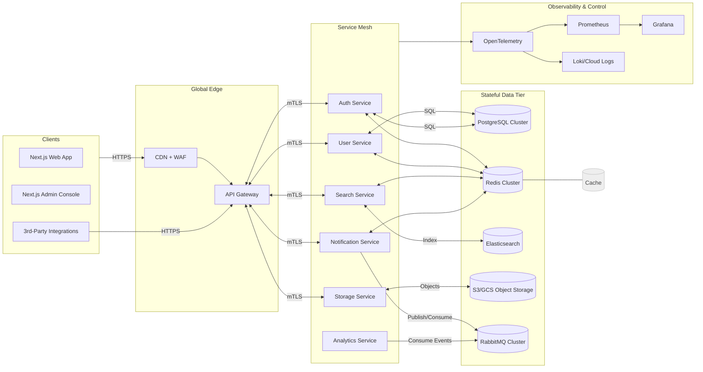

# System Overview

Cloud-native, multi-region platform built for reliability, scalability, and operational velocity.

## Architecture

**Client Layer**
- Web application (Next.js)
- Admin console (Next.js)
- Public APIs (REST/GraphQL/gRPC)
- Internal tooling

**Edge Layer**
- CDN with WAF
- API Gateway for routing and TLS termination
- Authentication and authorization
- Request quotas and rate limiting

**Service Layer**
- Independently scalable microservices
- Auth, User, Invoice, Search, Notification, Analytics, Storage
- API Gateway as ingress control plane

**Data Layer**
- PostgreSQL (OLTP, sharded/partitioned)
- Redis (caching, rate limits, queues)
- Elasticsearch (search and indexing)
- S3/GCS (object storage)
- RabbitMQ (async messaging)
- BigQuery/Snowflake (analytics)

**Platform**
- Kubernetes (EKS/GKE) orchestration
- Terraform infrastructure as code
- GitHub Actions CI/CD
- Service mesh (Istio/Linkerd) for mTLS
- OPA/Gatekeeper for policy enforcement
- Prometheus/Grafana for metrics
- OpenTelemetry for tracing
- CloudWatch/Cloud Logging for logs

**Reliability**
- Multi-AZ active-active deployment
- Optional multi-region with RPO near zero
- Stateless services with graceful degradation
- Circuit breakers and backpressure handling

**Security**
- Zero-trust architecture
- Short-lived credentials (OIDC)
- Secrets management and KMS encryption
- Fine-grained RBAC/ABAC
- Least privilege access

## Architecture Diagram

```mermaid
flowchart LR
  subgraph Clients
    Web[Next.js Web App]
    Admin[Next.js Admin Console]
    Integrations[3rd-Party Integrations]
  end

  subgraph Edge[Global Edge]
    CDN[CDN + WAF]
    APIGW[API Gateway]
  end

  Clients -->|HTTPS| CDN --> APIGW
  Integrations -->|HTTPS| APIGW

  subgraph Mesh[Service Mesh]
    direction LR
    AUTH[Auth Service]
    USER[User Service]
    SEARCH[Search Service]
    NOTIF[Notification Service]
    ANALYTICS[Analytics Service]
    STORAGE[Storage Service]
  end

  APIGW <-->|mTLS| AUTH
  APIGW <-->|mTLS| USER
  APIGW <-->|mTLS| SEARCH
  APIGW <-->|mTLS| NOTIF
  APIGW <-->|mTLS| STORAGE

  subgraph Data[Stateful Data Tier]
    direction TB
    PG[(PostgreSQL Cluster)]
    REDIS[(Redis Cluster)]
    ES[(Elasticsearch)]
    OBJ[(S3/GCS Object Storage)]
    MQ[(RabbitMQ Cluster)]
  end

  USER <-->|SQL| PG
  AUTH <-->|SQL| PG
  SEARCH <-->|Index| ES
  NOTIF -->|Publish/Consume| MQ
  ANALYTICS -->|Consume Events| MQ
  STORAGE <-->|Objects| OBJ
  ALLCACHE[(Cache)]:::ghost
  REDIS --- ALLCACHE
  AUTH <--> REDIS
  USER <--> REDIS
  SEARCH <--> REDIS
  NOTIF <--> REDIS

  subgraph Observability[Observability & Control]
    OTEL[OpenTelemetry]
    PROM[Prometheus]
    GRAF[Grafana]
    LOGS[Loki/Cloud Logs]
  end

  Mesh --> OTEL
  OTEL --> PROM
  OTEL --> LOGS
  PROM --> GRAF

  classDef ghost fill:#eee,stroke:#bbb,color:#444;
```

## Repository Structure

Organized to minimize coupling, maximize reuse, and enable high-velocity CI/CD. Clear separation between apps, services, shared packages, and infrastructure.

- apps/
  - web/                      Next.js end-user web app
  - admin-console/            Next.js admin console (internal)
- services/                   NestJS microservices
  - api-gateway/
  - auth-service/
  - user-service/
  - invoice-service/
  - search-service/
  - notification-service/
  - analytics-service/
  - storage-service/
- packages/                   Shared libraries (internal NPM packages)
  - common/                   DTOs, types, error codes, utilities
  - config/                   Configuration loader, schema validation
  - logger/                   OpenTelemetry + pino logger wrappers
  - sdk-js/                   Public JS SDK/Client
  - clients/                  API clients, message producers/consumers
- infrastructure/
  - kubernetes/               Base/overlays (kustomize/helm charts)
  - terraform/                IaC for AWS/GCP
    - modules/                VPC, EKS/GKE, RDS/Cloud SQL, Redis, ES, RabbitMQ, S3/GCS, etc.
    - environments/           dev, staging, prod
- docs/
  - services/                 Per-service deep dives
  - README.md                 This file
- .github/workflows/          GitHub Actions CI/CD pipelines
- scripts/                    Developer tooling scripts
- tsconfig.base.json          Base TS config shared across packages
- pnpm-workspace.yaml         Workspace definition
- docker-compose.yml          Local development stack (DB/Cache/etc.)

## Service Structure

Each service follows consistent conventions for reliability and maintainability.

**Standard Layout** (example: services/auth-service)

- services/auth-service/
  - src/
    - main.ts                 Bootstrap with fastify adapter, OpenTelemetry init, graceful shutdown
    - app.module.ts           Root module with ConfigModule, HealthModule, and feature modules
    - modules/
      - auth/
        - auth.controller.ts  REST controllers (public/private)
        - auth.service.ts     Business logic
        - auth.repository.ts  Data access using TypeORM
        - auth.module.ts
        - strategies/         JWT, OAuth2, SSO, API keys
        - guards/             RBAC/ABAC guards
        - dtos/               Request/response DTOs
      - health/
        - health.controller.ts Liveness/readiness endpoints
    - infra/
      - persistence/          ORM entities, migrations
      - messaging/            RabbitMQ producers/consumers
      - cache/                Redis abstractions
      - search/               Elasticsearch adapters (for search-service)
    - common/                 Filters, interceptors, pipes, constants
  - test/                     Unit + integration tests
  - Dockerfile                Multi-stage build with non-root user
  - helm/ or k8s/             Chart/manifests with HPA, PodDisruptionBudget, PodSecurityContext
  - .env.example              Local environment variables
  - README.md                 Service-specific documentation

**Service Responsibilities**

- **api-gateway** Aggregation, routing, schema validation, rate limiting, tracing
- **auth-service** Authentication (OAuth2, SSO), authorization (RBAC/ABAC), token management
- **user-service** Profile management, account lifecycle, GDPR compliance, audit logging
- **search-service** Indexing pipeline, relevance tuning, caching, autocomplete
- **notification-service** Multi-channel messaging, retry logic, templates, rate limiting
- **analytics-service** Event ingestion, stream processing, metrics, warehouse export
- **storage-service** Signed URLs, lifecycle policies, content scanning, metadata

## Deployment Pipeline

**Branching Strategy**
- Trunk-based development with PRs against develop/main
- Protected branches with required checks

**Continuous Integration**
- Static checks (ESLint, Prettier, TypeScript, dependency audit)
- Unit and integration tests with PostgreSQL and Redis
- Contract validation (OpenAPI/AsyncAPI/proto)
- Multi-arch Docker builds (amd64, arm64) with SBOM
- Security scanning (Trivy, CodeQL, tfsec, Checkov)
- Artifact push to ECR/GAR with immutable tags

**Continuous Deployment**
- Terraform plan/apply per environment
- GitOps deployments via ArgoCD/Flux
- Blue/green or canary releases via service mesh
- Post-deploy smoke tests and synthetic probes
- Automatic rollback on SLO violations

**Observability**
- OpenTelemetry traces with baggage propagation
- RED/USE metrics with alerting
- Structured logs with correlation IDs
- SLO monitoring with PagerDuty integration

## Component Details

**API Gateway**
- TLS termination, routing, schema validation
- Authentication delegation, quotas, rate limits
- Load shedding on overload
- Circuit breakers for unhealthy backends

**Auth Service**
- OAuth2/OIDC implementation
- JWT minting with short-lived tokens
- Refresh token rotation
- SSO providers (Google, Microsoft)
- PostgreSQL for users, Redis for sessions
- Optional KMS for key material

**User Service**
- Profile and preference management
- Organization and team management
- Invitation and billing workflows
- GDPR compliance (export/delete)

**Search Service**
- Indexing pipeline with idempotent upserts
- Multi-locale analyzers and synonyms
- Relevance tuning and caching
- Zero-downtime index rebuilds
- Outbox pattern for consistency

**Notification Service**
- Event consumption from RabbitMQ
- Multi-channel delivery (email, SMS, push, webhooks)
- Template rendering (Handlebars, MJML)
- Exponential backoff with DLQs
- Provider integration (SES, SendGrid, Twilio, FCM, APNs)

**Analytics Service**
- Asynchronous event ingestion
- Aggregates, funnels, cohort analysis
- API and dashboard exposure
- Data warehouse export

**Storage Service**
- Signed URL generation
- Virus and DLP scanning
- Lifecycle policies (IA/Glacier)
- Cross-region replication

**Data Tier**
- PostgreSQL: Partitioning, read replicas, multi-region replication
- Redis: Sharded cluster, TTL caches, rate limiting
- Elasticsearch: Multi-AZ, ILM policies, tiered storage
- RabbitMQ: Quorum queues, HA policies, idempotent consumers

**Platform**
- Kubernetes: Pod security, HPA/VPA, PDBs, topology spread
- Service Mesh: mTLS, retries, traffic shaping, fault injection
- Security: OPA policies, SBOM validation, workload identity, KMS encryption

## Implementation

This documentation provides a production-ready blueprint for building a scalable, reliable system. For service-specific details, see `docs/services/*.md`.
