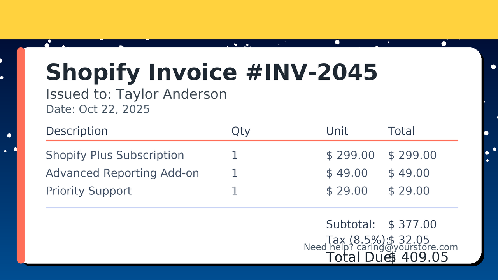
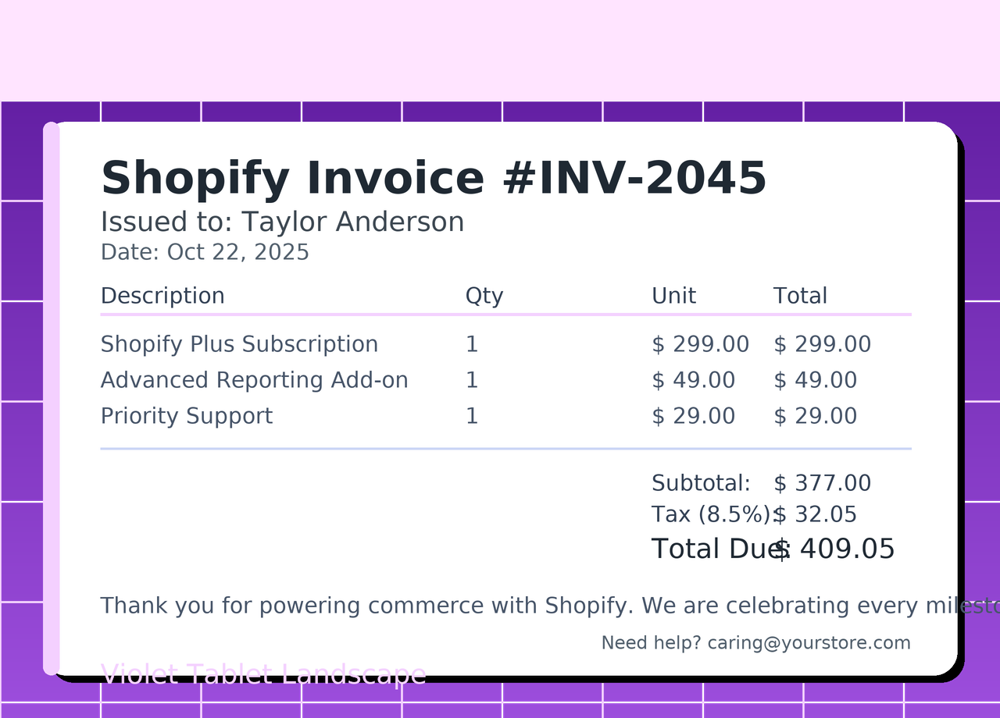
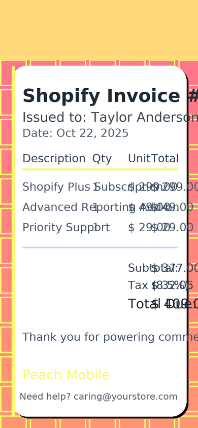
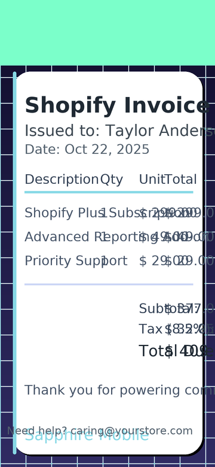

# Invoice Service

The Invoice Service orchestrates invoice generation, PDF rendering, and email delivery for Shopify merchants. It consumes Shopify order data, crafts a heartfelt gratitude message, renders a PDF invoice, and delivers it through AWS Simple Email Service (SES).

## Key Responsibilities

- Fetch order details directly from the configured Shopify store
- Generate branded PDF invoices with itemized breakdowns
- Compose a gratitude-rich email tailored to each merchant
- Deliver the invoice PDF via AWS SES using a MIME multipart message
- Provide a Mermaid diagram of the email flow for observability and documentation reuse

## Email Delivery Flow


## HTTP Endpoints

| Method | Path | Description |
| ------ | ---- | ----------- |
| `GET` | `/invoices/email/diagram` | Returns the Mermaid sequence diagram for downstream documentation reuse. |
| `POST` | `/invoices/email` | Generates a Shopify invoice PDF and emails it to the customer via AWS SES. |

### `POST /invoices/email`

```json
{
  "orderId": "5342193849132",
  "recipientEmail": "optional.override@example.com",
  "personalMessage": "We’re cheering for your next Shopify milestone!"
}
```

The service determines the customer email automatically if `recipientEmail` is omitted. It returns `202 Accepted` when the invoice email is successfully handed off to AWS SES.

## Environment Variables

| Variable | Description |
| -------- | ----------- |
| `INVOICE_SERVICE_PORT` | Listening port for the service. |
| `AWS_SES_REGION` | AWS region where SES is provisioned. |
| `AWS_SES_FROM_EMAIL` | Verified SES sender email address. |
| `AWS_SES_ACCESS_KEY_ID` | Optional explicit access key for SES (uses ambient credentials if omitted). |
| `AWS_SES_SECRET_ACCESS_KEY` | Optional explicit secret access key. |
| `SHOPIFY_STORE_DOMAIN` | Shopify store domain (e.g., `acme-store.myshopify.com`). |
| `SHOPIFY_ACCESS_TOKEN` | Private admin API access token with read_orders scope. |
| `SHOPIFY_API_VERSION` | Shopify Admin API version (defaults to `2023-10`). |
| `COMPANY_LEGAL_NAME` | Display name embedded inside the invoice PDF and email copy. |
| `COMPANY_SUPPORT_EMAIL` | Support contact included in the gratitude email template. |
| `COMPANY_POSTAL_ADDRESS` | Address printed on the invoice footer. |
| `INVOICE_DEFAULT_CURRENCY` | Currency fallback when Shopify omits a currency code. |

## Sample Output


You can download the PDF version [here](../assets/sample-invoice.pdf).

### Preview Gallery

<table>
  <tr>
    <th>Variation</th>
    <th>Preview</th>
  </tr>
  <tr>
    <td>Aurora Desktop (1600×1000)</td>
    <td></td>
  </tr>
  <tr>
    <td>Retro Sunset Desktop (1440×900)</td>
    <td></td>
  </tr>
  <tr>
    <td>Ocean Breeze Laptop (1366×768)</td>
    <td></td>
  </tr>
  <tr>
    <td>Midnight Gradient Laptop (1280×720)</td>
    <td></td>
  </tr>
  <tr>
    <td>Coral Tablet Portrait (1024×1366)</td>
    <td></td>
  </tr>
  <tr>
    <td>Violet Tablet Landscape (1280×920)</td>
    <td></td>
  </tr>
  <tr>
    <td>Emerald Mobile (414×896)</td>
    <td></td>
  </tr>
  <tr>
    <td>Peach Mobile (390×844)</td>
    <td></td>
  </tr>
  <tr>
    <td>Sapphire Mobile (360×780)</td>
    <td></td>
  </tr>
  <tr>
    <td>Neon Retro Board (1200×800)</td>
    <td></td>
  </tr>
</table>

All previews are available in the repository under `docs/assets/`, including 100 richly styled device variations for product and marketing teams.

## Email Tone & Template

Emails generated by this service open with a personalized, grateful greeting and close with a heartfelt thank-you, celebrating the merchant’s Shopify journey. The message automatically adapts to the customer’s name pulled from Shopify, reinforcing trust and appreciation in every invoice.
