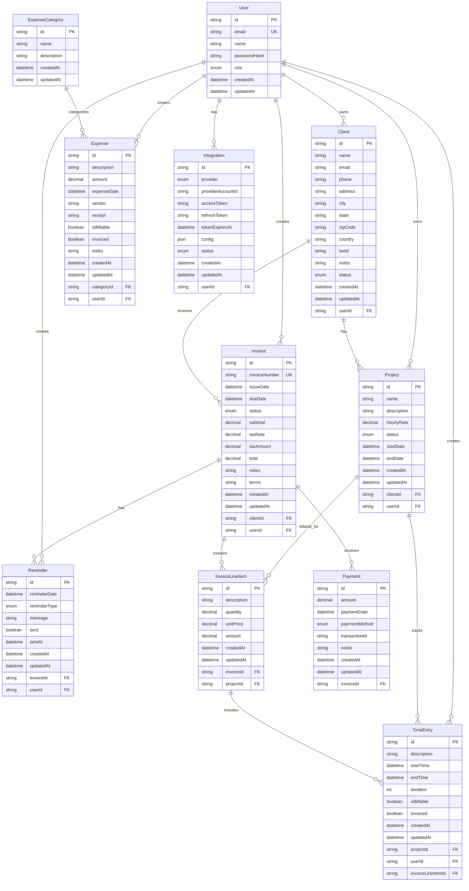

# Database Schema - Entity Relationship Diagram

## Overview

This document describes the database schema for the Invoice Flow SaaS application - a comprehensive time tracking and invoicing system.

## Entity Relationship Diagram



## Core Entities

### User
Represents users of the system who can create and manage invoices, clients, projects, and time entries.

**Key Fields:**
- `id`: Unique identifier (CUID)
- `email`: Unique email address for login
- `role`: User role (ADMIN, USER, VIEWER)

**Relationships:**
- One-to-many with Clients, Projects, TimeEntries, Invoices, Expenses, Reminders, and Integrations

### Client
Represents customers who receive invoices and have projects.

**Key Fields:**
- `name`: Client/company name
- `status`: Client status (ACTIVE, INACTIVE, ARCHIVED)
- `taxId`: Tax identification number for invoicing

**Relationships:**
- Many-to-one with User (owner)
- One-to-many with Projects and Invoices

### Project
Represents billable projects for clients with defined hourly rates.

**Key Fields:**
- `name`: Project name
- `hourlyRate`: Billing rate per hour (Decimal 10,2)
- `status`: Project status (ACTIVE, ON_HOLD, COMPLETED, CANCELLED)

**Relationships:**
- Many-to-one with Client and User
- One-to-many with TimeEntries and InvoiceLineItems

### TimeEntry
Tracks time spent on projects for billing purposes.

**Key Fields:**
- `startTime`: When work started
- `endTime`: When work ended (nullable for ongoing work)
- `duration`: Duration in minutes
- `isBillable`: Whether this time should be billed
- `invoiced`: Whether this time has been invoiced

**Relationships:**
- Many-to-one with Project, User, and InvoiceLineItem (optional)

### Invoice
Represents invoices sent to clients for completed work.

**Key Fields:**
- `invoiceNumber`: Unique invoice identifier
- `status`: Invoice status (DRAFT, SENT, VIEWED, PAID, OVERDUE, CANCELLED)
- `subtotal`, `taxRate`, `taxAmount`, `total`: Financial calculations
- `dueDate`: Payment due date

**Relationships:**
- Many-to-one with Client and User
- One-to-many with InvoiceLineItems, Payments, and Reminders

### InvoiceLineItem
Individual line items on an invoice, can be linked to projects and time entries.

**Key Fields:**
- `description`: Item description
- `quantity`: Number of units (Decimal 10,2)
- `unitPrice`: Price per unit (Decimal 10,2)
- `amount`: Total amount (quantity × unitPrice)

**Relationships:**
- Many-to-one with Invoice and Project (optional)
- One-to-many with TimeEntries

### Payment
Tracks payments received for invoices.

**Key Fields:**
- `amount`: Payment amount (Decimal 10,2)
- `paymentMethod`: How payment was received (CASH, CHECK, BANK_TRANSFER, etc.)
- `transactionId`: External transaction reference

**Relationships:**
- Many-to-one with Invoice

### ExpenseCategory
Categories for organizing business expenses.

**Key Fields:**
- `name`: Category name
- `description`: Category description

**Relationships:**
- One-to-many with Expenses

### Expense
Tracks business expenses that may be billable to clients.

**Key Fields:**
- `amount`: Expense amount (Decimal 10,2)
- `expenseDate`: When expense occurred
- `vendor`: Who was paid
- `receipt`: URL/path to receipt file
- `isBillable`: Can this be billed to a client
- `invoiced`: Has this been invoiced

**Relationships:**
- Many-to-one with ExpenseCategory and User

### Reminder
Automated reminders for invoice-related events.

**Key Fields:**
- `reminderDate`: When to send reminder
- `reminderType`: Type of reminder (PAYMENT_DUE, PAYMENT_OVERDUE, INVOICE_SENT, CUSTOM)
- `sent`: Whether reminder has been sent
- `sentAt`: When reminder was sent

**Relationships:**
- Many-to-one with Invoice and User

### Integration
Third-party service integrations (Stripe, PayPal, QuickBooks, etc.).

**Key Fields:**
- `provider`: Integration provider (STRIPE, PAYPAL, QUICKBOOKS, XERO, etc.)
- `accessToken`, `refreshToken`: OAuth tokens
- `config`: JSON configuration specific to provider
- `status`: Integration status (ACTIVE, INACTIVE, ERROR)

**Relationships:**
- Many-to-one with User
- Unique constraint on (userId, provider) - one integration per provider per user

## Enumerations

### UserRole
- `ADMIN`: Full system access
- `USER`: Standard user access
- `VIEWER`: Read-only access

### ClientStatus
- `ACTIVE`: Active client
- `INACTIVE`: Temporarily inactive
- `ARCHIVED`: Archived/deleted client

### ProjectStatus
- `ACTIVE`: Currently active project
- `ON_HOLD`: Temporarily paused
- `COMPLETED`: Finished successfully
- `CANCELLED`: Cancelled before completion

### InvoiceStatus
- `DRAFT`: Not yet sent
- `SENT`: Sent to client
- `VIEWED`: Client has viewed
- `PAID`: Payment received
- `OVERDUE`: Past due date without payment
- `CANCELLED`: Cancelled invoice

### PaymentMethod
- `CASH`: Cash payment
- `CHECK`: Check payment
- `BANK_TRANSFER`: Bank transfer/ACH
- `CREDIT_CARD`: Credit card
- `PAYPAL`: PayPal
- `STRIPE`: Stripe
- `OTHER`: Other payment method

### ReminderType
- `PAYMENT_DUE`: Payment due soon
- `PAYMENT_OVERDUE`: Payment is overdue
- `INVOICE_SENT`: Invoice was sent
- `CUSTOM`: Custom reminder

### IntegrationProvider
- `STRIPE`: Stripe payment processor
- `PAYPAL`: PayPal payment processor
- `QUICKBOOKS`: QuickBooks accounting
- `XERO`: Xero accounting
- `GOOGLE_CALENDAR`: Google Calendar
- `SLACK`: Slack messaging
- `ZAPIER`: Zapier automation

### IntegrationStatus
- `ACTIVE`: Integration is active
- `INACTIVE`: Integration is disabled
- `ERROR`: Integration has errors

## Indexes

Performance-critical indexes have been added to:

- Foreign keys (userId, clientId, projectId, etc.)
- Status fields for filtering
- Date fields for time-based queries (startTime, dueDate, paymentDate, etc.)
- Boolean flags for filtering (invoiced, sent, isBillable)
- Unique constraints (email, invoiceNumber, userId+provider)

## Cascade Behaviors

### ON DELETE CASCADE
Most foreign key relationships use CASCADE delete to maintain referential integrity:
- Deleting a User cascades to all their owned entities
- Deleting a Client cascades to Projects and Invoices
- Deleting an Invoice cascades to InvoiceLineItems, Payments, and Reminders
- Deleting a Project cascades to TimeEntries

### ON DELETE SET NULL
Some optional relationships use SET NULL:
- Deleting a Project sets projectId to NULL in InvoiceLineItems
- Deleting an InvoiceLineItem sets invoiceLineItemId to NULL in TimeEntries

## Data Types

### String Fields
- All IDs use CUID (Collision-resistant Unique Identifier)
- Text fields are variable length
- Email addresses are validated at application level

### Decimal Fields
- Currency amounts: `Decimal(10,2)` - up to 99,999,999.99
- Tax rates: `Decimal(5,2)` - up to 999.99%
- Quantities: `Decimal(10,2)` - supports fractional quantities

### DateTime Fields
- All timestamps use PostgreSQL TIMESTAMP(3) for millisecond precision
- `createdAt` defaults to NOW()
- `updatedAt` automatically updates on record changes

### JSON Fields
- `Integration.config` stores provider-specific configuration
- Flexible schema for different integration requirements

## Migration Commands

### Development
```bash
# Create and apply migrations
npm run db:migrate

# Apply existing migrations
npm run db:migrate:deploy

# Generate Prisma Client
npm run db:generate

# Open Prisma Studio (database GUI)
npm run db:studio

# Seed database with sample data
npm run db:seed
```

### Production
```bash
# Apply migrations only (no prompts)
npm run db:migrate:deploy

# Generate Prisma Client
npm run db:generate
```

## Seed Data

The seed script (`prisma/seed.js`) creates sample data including:

- 2 users (Admin and regular User)
- 3 clients (Acme Corporation, TechStart Inc, Global Industries)
- 4 projects with varying statuses
- Multiple time entries across projects
- 3 invoices in different states (DRAFT, SENT, PAID)
- Invoice line items linking to projects
- 2 payments for invoices
- 3 expense categories and 4 expenses
- Multiple reminders for invoices
- 3 integrations (Stripe, QuickBooks, Slack)

Run the seed with: `npm run db:seed`

## Best Practices

1. **Always use transactions** for operations that modify multiple related entities
2. **Validate business logic** at the application level before database operations
3. **Use soft deletes** for important entities if audit trail is needed (add `deletedAt` field)
4. **Index frequently queried fields** - already implemented for common use cases
5. **Use Prisma Client** generated types for type-safe database operations
6. **Keep migrations in version control** - already set up in `prisma/migrations/`
7. **Test migrations** on staging before production deployment

## Security Considerations

1. **Password hashing**: Store `passwordHash`, never plain passwords
2. **Token storage**: Integration tokens should be encrypted at rest
3. **Access control**: Implement row-level security in application logic
4. **Input validation**: Validate all inputs before database operations
5. **Rate limiting**: Implement for authentication and API endpoints
6. **Audit logging**: Consider adding audit trail for sensitive operations

## Future Enhancements

Potential schema enhancements for future versions:

1. **Multi-tenancy**: Add `organizationId` for team/company isolation
2. **Recurring invoices**: Add template and schedule tables
3. **Documents**: Add table for storing contracts, proposals, etc.
4. **Comments/Notes**: Add commenting system for collaboration
5. **Email templates**: Store customizable email templates
6. **Webhooks**: Add webhook configuration and logs
7. **Audit log**: Comprehensive change tracking
8. **File attachments**: Dedicated table for file metadata
9. **Tax rules**: Complex tax calculation rules
10. **Multi-currency**: Support for multiple currencies

## Support

For questions or issues with the database schema:
1. Check Prisma documentation: https://www.prisma.io/docs/
2. Review migration files in `prisma/migrations/`
3. Use Prisma Studio for visual database inspection: `npm run db:studio`
